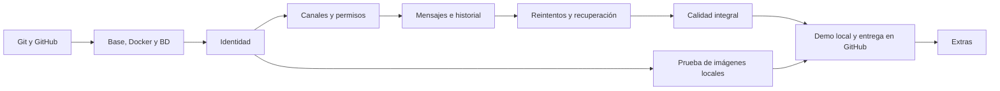

# Real-time Chat — Plan detallado de implementación

Revisión: 3 · Actualización: 2026-10-08 · Estado: tareas 0.0a–0.0c, 0.1a–0.1c, CP0-A y 0.2a–0.2c integrados; 0.2d implementada, pendiente de revisión y merge del propietario.

## 1. Cómo usar este plan

Este archivo conserva el alcance del plan inicial y es la **única lista de tareas** del proyecto; no crear una segunda lista en `tasks/todo.md`. El razonamiento de producto está en [docs/ideas/real-time-chat.md](../docs/ideas/real-time-chat.md).

Se incorporan 0.0a–0.0c para comenzar por GitHub. Los identificadores originales 0.1–6.4 se conservan como prefijos: por ejemplo, 3.2 se divide en 3.2a y 3.2b. Las casillas indican implementación verificada; el registro distingue una PR pendiente de cambios integrados. Los agentes dejan las PR abiertas: solo el propietario revisa y ejecuta el merge.

Para cada sesión:
1. Elegir la primera tarea cuyas dependencias estén completas.
2. Leer el contrato y las pruebas de aceptación de esa tarea.
3. Implementar el cambio mínimo y sus pruebas de comportamiento.
4. Ejecutar la verificación indicada y revisar el diff.
5. Marcar la casilla solo si cumple la aceptación; registrar evidencia y siguiente tarea.
6. Si una tarea excede dos horas o unas cinco unidades de código mantenidas a mano, dividirla conservando el prefijo. No reducir criterios para hacerla caber.

Las rutas de archivos de tareas pendientes son propuestas. Actualizarlas al adoptar las convenciones reales del scaffold. Los checkpoints requieren revisar resultados antes de continuar; no implican pedir permiso entre tareas ya autorizadas. El despliegue remoto queda fuera del alcance actual.

## 2. Producto, prioridades y demostración

**Usuario funcional:** miembro de un equipo pequeño que conversa por canales.
**Público del portfolio:** evaluador técnico que necesita comprobar calidad y comprender decisiones.
**Propuesta:** un chat pequeño cuyo comportamiento sigue siendo coherente ante desconexiones y respuestas perdidas.

Recorrido objetivo de demo: abrir dos sesiones → entrar al mismo canal → enviar → desconectar una sesión → enviar desde la otra → reconectar → comprobar historial sin duplicados. Un vídeo y pruebas reproducibles mostrarán los fallos difíciles; no añadir un panel de desarrollo a la interfaz pública.

| Prioridad | Contenido | Condición |
|---|---|---|
| P0: v1 | Identidad, canales, membresía, mensajes, historial, confirmaciones, idempotencia, resincronización, seguridad, UI responsive, pruebas, CI y presentación | Obligatorio |
| P1 | Cursor de lectura y no leídos por canal | Después de completar P0 |
| P2 | Escritura y presencia | Después de P1, si aportan valor |
| P3 | Benchmark reproducible | Opcional; no anunciar capacidad no medida |

Excluido: privados, organizaciones múltiples, roles administrativos, adjuntos, audio/vídeo, edición/borrado, hilos, reacciones, búsqueda avanzada, email transaccional, push, E2EE, cola offline duradera, outbox, microservicios, Redis y varias instancias.

Los canales son **abiertos para usuarios registrados**: cualquiera puede unirse y acceder al historial anterior. Membresía no equivale a confidencialidad. Salir impide nuevas operaciones y recepciones futuras del servidor, pero no elimina información ya recibida.

## 3. Supuestos y esfuerzo

Se conserva el objetivo inicial de 4–6 jornadas como referencia agresiva. El desglose revela más trabajo que el primer cálculo: **53–74 horas concentradas para P0, más 20 % de contingencia (64–89 h, redondeadas)**, aproximadamente 8–12 jornadas de ocho horas. Incluye GitHub y ejecución completa en contenedores. Es una estimación preliminar, no un resultado medido. Recalibrar después de identidad y de la primera conversación completa.

| Etapa | Esfuerzo P0 estimado | Resultado demostrable |
|---|---:|---|
| 0. GitHub y base | 8–11 h | Repositorio remoto, aplicación en Compose y CI |
| 1. Identidad | 7–10 h | Usuario autenticado y sockets en contenedores locales |
| 2. Conversación | 10–13 h | Dos usuarios conversan con historial |
| 3. Fiabilidad | 13–18 h | Respuesta perdida y reconexión correctas |
| 4. Calidad integral | 9–13 h | Seguridad, UX y suite crítica verificadas |
| 5. Entrega local | 6–9 h | Demo Docker y documentación reproducibles en GitHub |
| Total base | 53–74 h | V1 local completa |
| 6. Extras | Estimar cada extra después de P0 | No incluidos en el total |

Decisión confirmada por el usuario: completar el alcance aunque requiera más tiempo. La dedicación diaria real sigue pendiente; afecta al calendario, no a los criterios de entrega. Si posteriormente se acuerda una fecha de entrega, conservar los criterios P0 y registrar con claridad cualquier trabajo pendiente.

Decisión del usuario: **la aplicación se ejecutará solo en local por ahora**. GitHub alojará el código y ejecutará CI, pero no alojará la aplicación. No elegir proveedor, contratar hosting, configurar dominios, publicar imágenes en un registry ni preparar CD en esta entrega. La portabilidad futura se consigue con imágenes, configuración por entorno, migraciones y documentación.

## 4. Arquitectura y límites

Angular standalone, Signals para estado derivado de UI y RxJS para flujos asíncronos. Node.js/NestJS con Socket.IO. PostgreSQL/Prisma para persistencia y migraciones. Workspaces npm; monolito modular y una sola instancia de API. Versiones estables compatibles y lockfile se fijan en 0.1a, sin inventar versiones en este documento.

| Módulo | Posee | Consume |
|---|---|---|
| identity | Usuarios, hash de contraseña, sesiones y revocación | Base de datos |
| channels | Canales, membresías y política de acceso | identity |
| messaging | Mensajes, orden, idempotencia e historial | channels |
| activity, opcional | Cursor leído, escritura y presencia | messaging |

Los controladores y gateways son adaptadores delgados. Las reglas viven en servicios del dominio correspondiente; evitar duplicarlas entre HTTP y socket. No introducir repositorios genéricos, bus de eventos genérico, CQRS ni una capa por cada carpeta.

Un servicio de infraestructura puede indexar sockets por sesión/usuario y retirar suscripciones. Identidad emite una notificación de revocación local sin importar messaging: mantener dependencias de dominio en una sola dirección.

Estructura prevista:
```text
apps/web/src/app/
  core/                  # sesión y conexión
  features/auth/
  features/channels/
  features/chat/
apps/api/
  prisma/                # esquema, migraciones y seed
  src/identity/
  src/channels/
  src/messaging/
  src/realtime/          # gateway e índice local de conexiones
  src/health/
  test/
packages/contracts/src/  # DTO públicos, errores y validación compartida
e2e/                     # recorridos Playwright
docs/ideas/
docs/adr/
tasks/plan.md
```

Frontend y API se sirven bajo el mismo origen local, también mediante proxy en desarrollo. PostgreSQL conserva el estado durable; rooms y conexiones son efímeras. Socket.IO no es compatible directamente con cualquier cliente WebSocket nativo.

### Ejecución local obligatoria y portabilidad

Docker Engine/Docker Desktop con Compose v2 y Git serán suficientes para ejecutar la demo; no exigir Node ni PostgreSQL instalados en el host. Node local será opcional para quien prefiera desarrollar fuera de contenedores. Documentar soporte de Windows/Docker Desktop y permisos de volúmenes sin depender de scripts Bash.

| Servicio | Responsabilidad | Exposición |
|---|---|---|
| web | Servir Angular compilado y hacer proxy de /api y /socket.io hacia api | Solo 127.0.0.1:8080 por defecto |
| api | Node/NestJS, HTTP y Socket.IO | Red interna de Compose |
| db | PostgreSQL y volumen persistente | Red interna de Compose |
| migrate | Tarea de una ejecución que aplica migraciones versionadas | Sin puerto; termina antes de iniciar API |
| seed | Herramienta explícita para datos ficticios, perfil tools | Sin puerto; no se ejecuta en cada arranque |
| test | Herramientas de pruebas en entorno aislado, perfil test | Sin datos ni volúmenes de la demo |

Imágenes de web y API con etapas de build/runtime; objetivo tools para migraciones/seed y objetivos de desarrollo/test cuando hagan falta. Mantener dependencias de compilación fuera del runtime y no copiar .env, credenciales ni node_modules del host. Ejecutar procesos sin privilegios donde corresponda y no incluir secretos en argumentos de build.

Secuencia de arranque: BD saludable → migrate termina con éxito → API lista → web. Un contenedor arrancado no equivale a un servicio listo. Un fallo de migración bloquea API y deja un diagnóstico visible.

Compose normal sirve builds compilados sin bind mounts del código. Un override de desarrollo habilita recarga y volúmenes de código; dependencias Linux permanecen dentro de contenedores. No añadir Kubernetes, Terraform ni herramientas de despliegue sin necesidad.

Persistencia: docker compose down conserva el volumen de BD. Un reset destructivo es un comando separado, solo para datos de demo y con destino explícito. Probar arranque desde un volumen nuevo y reinicio sobre uno existente.

HTTP en localhost: cookie HttpOnly y SameSite con Secure desactivado únicamente en configuración local explícita. La configuración preparada para HTTPS futuro exige Secure. API y Socket.IO usan rutas relativas; no compilar un dominio o proveedor dentro del frontend.

Despliegue futuro, fuera de P0: documentar cambios necesarios (origen/HTTPS, secretos, BD y backups, proxy y migraciones) sin ejecutarlos. No se afirma que un proveedor remoto esté validado por funcionar en Docker local.

## 5. Modelo de datos mínimo

Crear cada tabla cuando su recorrido la necesite, no todo el esquema de antemano.

| Entidad | Campos esenciales | Restricciones / índices |
|---|---|---|
| User | id UUID, emailNormalizado, displayName, passwordHash, createdAt | Email único; no devolver hash ni email en mensajes |
| Session | id, userId, tokenHash, expiresAt, createdAt | tokenHash único; índice por userId y expiresAt |
| Channel | id UUID, slug, name, createdBy, lastSequence, createdAt | slug único; lastSequence comienza en 0 |
| Membership | userId, channelId, joinedAt | Clave compuesta; índice por channelId para miembros |
| Message | id UUID, channelId, authorId, clientMessageId, sequence, body, createdAt | Únicos (authorId, clientMessageId) y (channelId, sequence) |
| ReadCursor, P1 | userId, channelId, lastReadSequence | Clave compuesta; avance monotónico |

Las relaciones usan claves foráneas. No hay borrado de usuarios/canales/mensajes en P0. Secuencias BIGINT se serializan como cadenas decimales en JSON y se comparan numéricamente, nunca lexicográficamente ni convirtiendo ciegamente a Number.

El índice compuesto de mensajes sirve a las consultas por canal y secuencia; justificar índices adicionales mediante consultas reales. Migraciones versionadas, seed idempotente y ninguna sincronización destructiva de esquema en producción.

## 6. Contratos de comportamiento

### 6.1 Identidad y permisos

Sesión opaca aleatoria, solo su hash en BD; cookie HttpOnly, Secure en producción y SameSite=Lax. Duración absoluta inicial: 24 h, configurable. Logout revoca **la sesión actual**, incluidas sus conexiones; otras sesiones del usuario siguen funcionando. Sin refresh tokens ni recuperación de contraseña en P0.

Validar origen y proteger mutaciones HTTP con token CSRF vinculado a sesión; bootstrap de token preautenticado para registro/login. Validar origen también en el handshake y en todos los transportes habilitados. El handshake comprueba sesión, pero no sustituye autorización por operación.

Caducidad: temporizador por sesión conectada y nueva validación antes de operaciones; al revocar, desconectar sockets de esa sesión. Una conexión inactiva tampoco puede continuar recibiendo indefinidamente. Un evento ya enviado por red no puede retirarse.

Unirse crea Membership; suscribirse a eventos solo observa un canal del que ya se es miembro. Mantener separados esos conceptos. La v1 observa el canal seleccionado; el cambio de canal cancela peticiones obsoletas y cambia la suscripción.

### 6.2 HTTP propuesto

Rutas bajo `/api`. Cerrar cada contrato al implementar su recorrido; no diseñar todavía los endpoints de los extras.

| Método y ruta | Entrada / salida relevante | Permiso |
|---|---|---|
| GET /auth/csrf | Token para formulario preauth o sesión | Origen permitido |
| POST /auth/register | email, password, displayName → usuario público; continuar a login | Preauth y CSRF |
| POST /auth/login | Credenciales → cookie y usuario | Preauth y CSRF |
| GET /auth/me | Usuario actual | Sesión |
| POST /auth/logout | Revoca sesión; limpia cookie | Sesión y CSRF |
| GET /channels | Página de canales con isMember | Sesión |
| POST /channels | name, slug → canal y membresía del creador | Sesión y CSRF |
| PUT /channels/:id/membership | Unión idempotente | Sesión y CSRF |
| DELETE /channels/:id/membership | Salida idempotente y retirada de suscripciones | Sesión y CSRF |
| GET /channels/:id/messages | before opcional, limit → items ASC, olderCursor, snapshotCursor | Miembro |
| GET /channels/:id/messages/sync | after, until opcional, limit → items ASC, nextCursor, until, hasMore | Miembro |
| GET /health/live | Proceso vivo | Público, sin detalles internos |
| GET /health/ready | Capacidad de atender con BD | Público, respuesta mínima |

`before` y `after` son excluyentes por diseño de rutas. Cursores versionados con canal y secuencia, validados; cursor opaco no equivale a autorización ni necesita contener secretos. Un cursor de otro canal se rechaza.

Error común: `{ code, message, requestId, fieldErrors? }`. Códigos: VALIDATION_ERROR, UNAUTHENTICATED, FORBIDDEN, NOT_FOUND, CONFLICT, RATE_LIMITED, INTERNAL_ERROR. Mapear HTTP a 400/401/403/404/409/429/500; no enviar stack traces. El cliente decide por code, no por texto.

### 6.3 Socket.IO propuesto

| Dirección | Evento | Datos / resultado |
|---|---|---|
| Cliente → servidor | channel:subscribe | channelId; ack tras comprobar sesión y membresía |
| Cliente → servidor | channel:unsubscribe | channelId; idempotente |
| Cliente → servidor | message:send | channelId, clientMessageId UUID, body; ack con mensaje persistido |
| Servidor → cliente | message:created | Mensaje canónico con id, sequence, autor público y fecha |
| Servidor → cliente | channel:access-revoked | channelId; limpiar vista y cursor local de ese canal |
| Servidor → cliente | session:revoked | Motivo seguro; después desconectar |
| Ambos | Eventos de conexión propios de Socket.IO | Conectado, desconectado, reconectando |

Ack: `{ ok: true, data }` o `{ ok: false, error }`. Autor y sesión proceden del servidor. Ambos caminos, ack y message:created, pueden llegar en cualquier orden; el reducer debe reconciliarlos.

P0 no depende de connection-state recovery nativa de Socket.IO. La recuperación propia funciona también después de reiniciar la API. No añadir una segunda estrategia de recuperación hasta medir la necesidad.

### 6.4 Persistencia, idempotencia y orden

1. Validar sesión, payload y límites.
2. Abrir transacción; bloquear la fila del canal y verificar membresía actual.
3. Buscar la clave (autor, clientMessageId). Si existe y coincide canal/contenido, devolver el mismo mensaje; si difiere, CONFLICT. Volver a autorizar también los reintentos.
4. Para un mensaje nuevo, incrementar lastSequence e insertar dentro de la misma transacción.
5. Confirmar transacción. Solo entonces emitir y responder.
6. Ante colisión concurrente de clave única, resolver fuera de la transacción abortada, con una lectura autorizada del registro existente. No convertir cualquier error de BD en éxito.

El contador y los envíos del mismo canal se serializan. Una secuencia global o una fecha no bastan para representar el orden de commit. No realizar llamadas de red ni hashes de contraseñas mientras se mantiene el bloqueo.

Unión/salida y envío usan un orden consistente de bloqueos del canal. Si el envío se autoriza antes de la salida puede completarse; si la salida se confirma primero, se rechaza. La retirada de rooms debe completarse antes del ack de salida. Coordinar suscripción/salida y emisión en la instancia para que una suscripción en carrera no quede autorizada después; documentar el punto de orden y probar ambos órdenes. No construir un motor de permisos genérico.

No se promete entrega exactamente una vez. Se ofrece persistencia deduplicada y convergencia del cliente tras reconciliar, mientras el usuario siga autorizado.

### 6.5 Recuperación sin huecos

Separar **olderCursor** (pasado no cargado) y **syncCursor C** (novedades recuperadas de manera completa). Un evento vivo puede actualizar la lista, pero nunca avanzar C por sí solo.

Carga inicial: suscribirse, solicitar la cola reciente con un límite superior confirmado H y mezclar eventos por ID. La consulta incluye solo mensajes con secuencia ≤ H. Al completar la respuesta, fijar C=H; mensajes anteriores no cargados se solicitan por olderCursor.

Recuperación: capturar H al iniciar y paginar el intervalo (C,H]. Todas las páginas mantienen H. Avanzar C únicamente después de incorporar la página completa; cuando termina, C=H. Eventos > H se mezclan visualmente y serán confirmados por la siguiente recuperación. Así la recuperación termina aunque siga llegando tráfico.

Disparadores: reconexión, entrada al canal, recuperación del foco y cada 15 s mientras el canal esté visible y conectado. Una recuperación activa por canal; cancelar al salir y descartar respuestas de una selección anterior. Revalidar membresía en cada página.

Reconciliación periódica cubre commit sin emisión incluso sin desconexión detectable. El intervalo es configurable, no una garantía de latencia bajo fallos. Si hay cursor inválido o nueva generación de datos demo, descartar estado del canal y cargar una instantánea nueva.

### 6.6 Estados y UX

- Envío: **pendiente → confirmado**, **pendiente → sin confirmar** por timeout y **pendiente → rechazado** ante error definitivo.
- Timeout no prueba que el mensaje se haya perdido. Reintentar conserva clientMessageId y body; editar tras rechazo crea un envío nuevo.
- Ack tardío o evento del mismo mensaje sustituye al pendiente, sin duplicar. No reintentar automáticamente errores de validación/autorización.
- Conexión: conectando, conectado, reconectando, desconectado y sesión expirada. Desactivar envío nuevo sin conexión; conservar borrador en memoria.
- Historial: carga inicial, vacío, listo, cargando anteriores y error recuperable. Mantener el scroll al anteponer mensajes.
- No saltar al final si el usuario lee mensajes anteriores; mostrar acción para ver nuevos mensajes.
- Enter envía, Shift+Enter inserta línea; respetar composición de teclado/IME. Formularios etiquetados, foco visible y avisos accesibles sin anunciar de golpe todo el historial.
- Una lista de mensajes por canal visible, paginada. Si aparecen problemas de rendimiento, medir antes de añadir virtualización.

### 6.7 Valores iniciales para validar

Son decisiones del proyecto, configurables y revisables con evidencia, no capacidades garantizadas por las bibliotecas.

| Parámetro | Valor inicial |
|---|---|
| Texto | 1–2.000 puntos de código Unicode; rechazar texto solo en blanco |
| Frame/payload socket | Máximo 16 KiB |
| Página de historial/canales | 50 por defecto, máximo 100 |
| Confirmación | Timeout 5 s; un reintento automático con la misma clave, luego acción manual |
| Reconciliación | 15 s en canal visible/conectado; reintentos de consulta con backoff acotado |
| Sesión | 24 h absolutas; configurable para pruebas |
| Envíos | 30 por 10 s por usuario, sumando sus sockets |
| Login | 10 intentos por minuto por IP; ajuste para entorno demo |
| Registro / creación de canales | 5 por hora por IP / 10 por hora por usuario |
| Conexiones | 5 simultáneas por sesión; política de error documentada |

Usar reloj controlado para pruebas de límites. Configurar confianza en proxy explícitamente antes de usar IP reenviada. Límites en memoria son aceptables para una instancia y se reinician con el proceso; dejar esa limitación documentada.

## 7. Herramientas, pruebas y definición de terminado

Comandos objetivo, **todavía no implementados**. Desde el repositorio clonado, copiar .env.example a .env y ajustar únicamente valores locales; documentar la copia equivalente en PowerShell y shells Unix.

Ruta principal, sin Node ni PostgreSQL en el host:
```text
docker compose config --quiet
docker compose up --build -d --wait
docker compose --profile tools run --rm seed
docker compose ps
docker compose logs --tail=100 api
docker compose restart api
docker compose down
```

La tarea migrate forma parte del arranque y debe terminar correctamente antes de api. Seed se añade en 5.1a; hasta entonces crear usuarios mediante registro. Entrada local prevista: http://localhost:8080. down no lleva -v.

Verificación en contenedores, al implementar los servicios de test:
```text
docker compose -f compose.test.yaml --profile test run --rm test
```
El archivo de pruebas usa nombre de proyecto/volumen aislado y ejecuta lint, tipos, pruebas y build con estado de salida no cero ante cualquier fallo. CI utiliza ese entorno o comandos equivalentes y además comprueba las imágenes/runtime de Compose.

Ruta opcional de desarrollo con Node local:
```text
npm ci
npm run dev
npm run lint
npm run typecheck
npm test
npm run test:integration
npm run test:e2e
npm run build
```
La ruta containerizada de desarrollo usa compose.yaml más compose.dev.yaml; detallar el comando final al crear el override.

Crear scripts de pruebas cuando exista la primera prueba de ese nivel; no usar flags que simulen éxito si faltan pruebas. Definir comandos de migración local y despliegue por separado durante 0.2b, para no ejecutar migraciones de desarrollo sobre producción.

Unitarias: reducer, transiciones de estado y cursores. Integración: servicios/API/gateway con PostgreSQL y clientes Socket.IO reales. E2E: Playwright con contextos aislados. Elegir runners compatibles con los scaffolds; no forzar uno distinto solo por uniformidad.

Pruebas de fallos mediante dependencias sustituibles o hooks exclusivos del entorno de test; nunca endpoints públicos que permitan provocar caídas. Usar barreras/promesas para coordinar carreras, no sleeps arbitrarios.

Una tarea termina cuando cumple aceptación, pasa su verificación, maneja errores relevantes, no filtra secretos y registra evidencia. Un checkpoint incluye build y revisión de las pruebas afectadas; ejecutar toda la suite en los cierres de etapa que lo indiquen. No imponer una cifra de cobertura sin relación con riesgos.

## 8. Etapas y tareas

S = cambio pequeño; M = sesión de hasta dos horas como objetivo. Los archivos enumerados son las principales unidades de trabajo manual; el scaffold genera archivos adicionales que se revisan en su tarea. Si el trabajo real crece, dividirlo antes de continuar.

### Etapa 0 — GitHub y base reproducible

**Objetivo:** configurar primero GitHub, después arrancar web, API y BD en contenedores y verificar la base en CI.

- [x] **0.0a — Preparar el repositorio Git local** · S · Depende de: ninguna.
  - Trabajo: inspeccionar Git existente, conservar cambios/historial y estos documentos; inicializar solo si no existe repositorio. Preparar main, ignores y un README inicial. Comprobar identidad Git sin alterar configuración global.
  - Aceptación: archivos de planificación conservados; .env, credenciales, dependencias y salidas de build excluidos; primer commit revisado.
  - Verificar: git status, git diff --cached y git log; comprobar que no se añade material sensible.
  - Archivos: .gitignore, README.md y documentos actuales; metadatos Git locales.
- [x] **0.0b — Crear o vincular el repositorio en GitHub** · S · Depende de: 0.0a.
  - Trabajo: comprobar cuenta autenticada y repositorio existente; usar real-time-chat como nombre propuesto, resolver propietario y visibilidad antes de crearlo. Reutilizar el remoto correcto si existe; no sobrescribir historial remoto.
  - Aceptación: origin apunta al repositorio acordado, main está sincronizada y contiene el plan; GitHub no ejecuta ni despliega la aplicación.
  - Verificar: remoto, rama por defecto, archivos en GitHub y clonación a un directorio temporal limpio.
  - Archivos: README.md con enlace del repositorio; configuración remota Git/GitHub.
- [x] **0.0c — Definir el flujo de trabajo de GitHub** · S · Depende de: 0.0b.
  - Trabajo: descripción/topics, plantilla breve de PR y convención de ramas/commits. Mantener tareas en este archivo; no duplicarlas en Projects o Issues. Añadir protección de main y checks cuando CI exista y la cuenta lo permita, sin exigir aprobador externo en un proyecto individual.
  - Aceptación: cambios pequeños revisables; se documenta cómo integrar una etapa y registrar evidencia. No crear workflows de despliegue ni credenciales de hosting.
  - Verificar: revisar ajustes y plantilla; distinguir reglas aplicadas de recomendaciones todavía pendientes.
  - Archivos: .github/pull_request_template.md, CONTRIBUTING.md, README.md.

**Checkpoint CP0-G:** repositorio de GitHub creado o vinculado y plan versionado; el trabajo de aplicación empieza a continuación.

- [x] **0.1a — Fijar runtime y workspace** · S · Depende de: 0.0c.
  - Trabajo: elegir versiones compatibles, scripts comunes y gestor npm; documentar requisitos locales.
  - Aceptación: instalación reproducible con lockfile; configuración estricta y sin secretos.
  - Verificar: instalación limpia y lectura de versiones reales.
  - Archivos: `package.json`, `package-lock.json`, `.node-version`, `.npmrc`, `tsconfig.base.json`, `README.md`; `.gitignore` ya cubre node_modules. Configuración pequeña repartida por responsabilidad, sin scaffolds ni paquetes vacíos.
- [x] **0.1b — Arrancar la API** · M · Depende de: 0.1a. Integrada mediante PR #2 por el propietario.
  - Trabajo: scaffold NestJS mínimo, validación de configuración y endpoint live.
  - Aceptación: responde 200 y rechaza configuración obligatoria ausente con error comprensible.
  - Verificar: build API y prueba HTTP de live.
  - Archivos: `apps/api/package.json`, `src/main.ts`, `src/app.module.ts`, `src/health/live.controller.ts`, `test/health.spec.ts` dentro de apps/api salvo indicación.
  - Evidencia: NestJS 12.1.2; GET /api/health/live → 200 con status=ok; NODE_ENV/PORT obligatorios y HOST validado; npm ci, 15 pruebas con node:test, build y typecheck correctos. Arranque con npm start y .env comprobado; sin BD ni Docker todavía.
- [x] **0.1c — Arrancar la web** · M · Depende de: 0.1a, 0.1b. Integrada mediante PR #3 por el propietario.
  - Trabajo: scaffold Angular, shell con navegación mínima y proxy de desarrollo a API.
  - Aceptación: pantalla inicial consume live bajo el mismo origen; estados de carga/error visibles.
  - Verificar: build web y navegador con API disponible y detenida.
  - Archivos: `apps/web/package.json`, `angular.json`, `proxy.conf.json`, `src/app/app.ts`, `src/app/app.html` dentro de apps/web.
  - Evidencia: Angular 22.2.1 con CLI/build 22.2.2; proxy /api/**; carga, error, reintento y timeout de 5 s; 3 pruebas web y 15 API; build y typecheck de ambos workspaces. Chrome confirma error con API detenida y recuperación al arrancarla; sin desbordamiento a 320/768/1024/1440 px; enlace de salto mueve el foco a main. Commits incrementales publicados para revisión.

**Checkpoint CP0-A:** web y API arrancan por los comandos documentados; revisar scaffolds y eliminar ejemplos innecesarios.

Resultado (2026-10-08): **superado** sobre main `e6664d6`.
- `npm run toolchain:versions`: Node 24.21.0, npm 12.1.0, TypeScript 6.0.3.
- `npm run build`, `npm run typecheck` y `npm test`: correctos; 15 pruebas API y 3 web.
- Comprobación de las pruebas: invertir temporalmente la condición de status provocó dos fallos esperados; código original restaurado sin cambios de aplicación.
- `npm start` y `npm run start:web`: arranque correcto con la configuración local; live devuelve 200 y `{"status":"ok"}` tanto en el puerto 3000 como mediante el proxy del 4200.
- Chrome muestra API disponible; al detener la API y repetir la comprobación muestra error y permite reintentar. Servidores de comprobación detenidos al finalizar.
- Revisión de scaffolds: sin Hello World, páginas de ejemplo, servicios vacíos ni artefactos generados versionados. Los archivos actuales soportan arranque, configuración, interfaz o pruebas; no hace falta eliminar código.
- Docker y proxy de producción siguen en 0.2c; lint y CI en 0.3b. No bloquean este checkpoint de arranque local.

- [x] **0.2a — Levantar PostgreSQL local** · S · Depende de: 0.1a. Integrada mediante PR #5 por el propietario.
  - Trabajo: Compose con volumen, health check y configuración ejemplo.
  - Aceptación: BD disponible, credenciales fuera del repositorio y reinicio sin perder datos.
  - Verificar: arranque, conexión y reinicio con un registro de prueba.
  - Archivos: `compose.yaml`, `.env.example`, `README.md`.
  - Evidencia: PostgreSQL 18.6-bookworm; health check healthy; conexión de red autenticada y rechazo de contraseña incorrecta; Compose rechaza contraseña vacía. Volumen real-time-chat_postgres_data conserva un registro tras down/up; tabla de prueba eliminada. Puerto solo 127.0.0.1:5432; credenciales generadas en .env ignorado. Base detenida conservando volumen al finalizar. Integración Prisma pendiente de 0.2b.
- [x] **0.2b — Integrar Prisma y la primera migración** · M · Depende de: 0.1b, 0.2a. Integrada mediante PR #6 por el propietario.
  - Trabajo: User y Session, servicio de BD, scripts de migración para local/despliegue y conexión de tests.
  - Aceptación: migración reproducible sobre BD vacía; conexión cerrada al finalizar tests.
  - Verificar: migrar y probar restricciones de email/tokenHash con PostgreSQL real.
  - Archivos: `apps/api/prisma/schema.prisma`, migración generada, `src/database/database.service.ts`, `test/database.spec.ts`, `apps/api/package.json`.
  - Evidencia: Prisma 7.10.0, cliente ESM generado e ignorado; migración User/Session aplicada a BD vacía y repetida sin pendientes. Nest comprueba conexión al arrancar y libera pool al cerrar; DATABASE_URL validada sin exponer credenciales. 16 pruebas API, 3 web y 6 resultados de integración en BD separada real_time_chat_test (unicidad email/tokenHash, FK, rollback, cierre, fallo de conexión). npm ci, build y typecheck correctos; audit sin vulnerabilidades con overrides documentados del CLI. Pruebas en test/integration/database.spec.ts; datos de prueba eliminados y procesos detenidos.
- [x] **0.2c — Ejecutar toda la aplicación con Compose** · M · Depende de: 0.1c, 0.2b. Integrada mediante PR #7 por el propietario.
  - Trabajo: Dockerfiles web/API y Compose con red interna, volumen, proxy y tarea migrate; exponer solo web en loopback.
  - Aceptación: desde clon limpio, up --build --wait sirve la pantalla y conecta con BD sin Node/PostgreSQL en el host; un error de migración impide iniciar API.
  - Verificar: config --quiet, arranque desde volumen nuevo, logs/health, down y nuevo up conservando datos.
  - Archivos: apps/web/Dockerfile, apps/api/Dockerfile, compose.yaml, docker/nginx.conf, .dockerignore.
  - Evidencia: imágenes multi-stage construidas con 16 pruebas API y 3 web en Linux; 2 pruebas de URL/credenciales. Stack healthy y live HTTP 200 en navegador mediante Nginx; solo web publicado en loopback, API/web no root. Clon local limpio sin dependencias del host y volumen nuevo verificados; migración exitosa antes de API; fallo controlado exit 17 bloquea API/web. Registro conserva datos tras down/up. Runtime sin Prisma CLI/TypeScript; motor de migración incluido al construir la imagen. Override compose.host.yaml explícito verificado con 6 resultados de integración. Stack detenido, volumen principal conservado y volumen de prueba eliminado.
- [x] **0.2d — Preparar desarrollo en contenedores** · M · Depende de: 0.2c. Implementada en rama; merge pendiente del propietario.
  - Trabajo: override de desarrollo con recarga de web/API y dependencias internas; instrucciones Windows y Unix.
  - Aceptación: editar código actualiza el servicio sin reconstruir todo; node_modules del host no pisa dependencias Linux.
  - Verificar: modificar un texto y un handler temporalmente, comprobar recarga y restaurar; comprobar paridad con build normal.
    - Archivos: compose.dev.yaml, Dockerfiles web/API, README.md.
    - Evidencia: Compose Watch 5.5.1 en Windows sincroniza texto Angular sin refrescar el navegador y reinicia/recompila API al editar su handler. Respuesta temporal HTTP confirmada; ambos cambios restaurados y recargados. Identificadores de imágenes iguales antes/después; API/web con usuario node y sin mounts del host. Typecheck de ambos servicios correcto dentro de Docker. Dependencias/configuración/esquema requieren down y up --build --watch explícitos; comandos compatibles con PowerShell y Unix documentados.

**Checkpoint CP0-D:** demo base y desarrollo funcionan en Docker; el host no necesita instalar herramientas del stack.

- [ ] **0.3a — Establecer contrato de error** · S · Depende de: 0.1b, 0.1c.
  - Trabajo: paquete contracts, error público y mapeo HTTP; mantenerlo limitado al recorrido actual.
  - Aceptación: un error validado contiene code/requestId sin stack; web puede interpretarlo.
  - Verificar: prueba del error y build de consumidores.
  - Archivos: `packages/contracts/package.json`, `src/errors.ts` dentro del paquete, `apps/api/src/http/error.filter.ts`, `apps/api/test/errors.spec.ts`, configuración de alias.

**Checkpoint CP0-B:** BD nueva migrada, errores seguros y tipos compartidos compilables.

- [ ] **0.3b — Añadir CI inicial** · M · Depende de: 0.0c, 0.2d, 0.3a.
  - Trabajo: lint, tipos, pruebas existentes y build; PostgreSQL efímero para integración y caches reproducibles.
  - Aceptación: errores detienen el pipeline; no exponer credenciales reales ni omitir fallos.
  - Verificar: comandos locales equivalentes y ejecución real de GitHub Actions sobre el remoto de 0.0b; comprobar build de imágenes sin publicarlas.
  - Archivos: `.github/workflows/ci.yml`, `package.json`, configuración lint, configuración de tests, `README.md`.

**Salida CP0-C:** clon limpio arranca en Docker, CI pasa en GitHub y el plan está versionado. Configurar los checks de main definidos en 0.0c según disponibilidad.

### Etapa 1 — Identidad y validación en Docker local

**Objetivo:** un usuario completa registro/login/logout; el navegador restaura una sesión válida.

- [ ] **1.1a — Registrar una cuenta en API** · M · Depende de: 0.2b, 0.3a.
  - Trabajo: normalización de email, validación de nombre/contraseña, hash Argon2id y CSRF preauth; contrato con errores.
  - Aceptación: cuenta persistida, duplicado controlado y ningún hash expuesto.
  - Verificar: integración válida, inválida, duplicada y petición sin protección CSRF.
  - Archivos: `packages/contracts/src/auth.ts`, `apps/api/src/identity/registration.service.ts`, `registration.controller.ts`, `csrf.service.ts`, `apps/api/test/registration.spec.ts`.
- [ ] **1.1b — Completar registro desde Angular** · M · Depende de: 1.1a, 0.1c.
  - Trabajo: formulario accesible y cliente de identidad; tras éxito dirigir a login.
  - Aceptación: validaciones comprensibles, estado de envío y prevención de doble submit.
  - Verificar: navegador/primer E2E de registro, incluyendo error servidor.
  - Archivos: `apps/web/src/app/features/auth/register.ts`, `register.html`, `apps/web/src/app/core/auth-client.ts`, rutas web, `e2e/register.spec.ts`.

**Checkpoint CP1-A:** cuenta creada desde navegador; BD y respuesta no filtran credenciales.

- [ ] **1.2a — Crear y consultar sesiones** · M · Depende de: 1.1a.
  - Trabajo: login, cookie segura, hash de token, expiración absoluta y /me.
  - Aceptación: credenciales incorrectas dan error genérico; sesión válida se restaura y sesión caducada se rechaza.
  - Verificar: integración de cookie, token desconocido, expiración y CSRF en login.
  - Archivos: `apps/api/src/identity/session.service.ts`, `session.controller.ts`, `session.guard.ts`, `apps/api/test/session.spec.ts`, contrato auth.
- [ ] **1.2b — Integrar login y rutas protegidas** · M · Depende de: 1.2a, 1.1b.
  - Trabajo: pantalla login, estado de sesión y restauración antes de resolver rutas protegidas.
  - Aceptación: recarga mantiene sesión; 401 muestra acceso requerido y no crea bucles de redirección.
  - Verificar: E2E login → recarga → navegación; error y sesión expirada.
  - Archivos: `apps/web/src/app/features/auth/login.ts`, `login.html`, `core/session.store.ts`, `core/auth.guard.ts`, `e2e/session.spec.ts` con prefijos web correspondientes.
- [ ] **1.2c — Revocar la sesión actual** · M · Depende de: 1.2a, 1.2b.
  - Trabajo: logout HTTP, limpieza de cookie y estado cliente; evento local de revocación para futura integración socket.
  - Aceptación: token revocado falla en /me; otra sesión del usuario permanece válida.
  - Verificar: integración con dos sesiones y E2E de logout/recarga.
  - Archivos: servicio/controller de sesiones, store web, `apps/api/test/logout.spec.ts`, `e2e/session.spec.ts`.

**Checkpoint CP1-B:** flujo completo de identidad y límites de sesión verificados; ejecutar suite de identidad y build.

- [ ] **1.3a — Validar handshake autenticado a través del proxy local** · M · Depende de: 1.2c, 0.3b.
  - Trabajo: gateway autenticado y rutas de proxy HTTP/Socket.IO en las imágenes de 0.2c; parametrizar origen y cookies para localhost.
  - Aceptación: login y conexión persistente funcionan en http://localhost:8080; origen ajeno rechazado y configuración Secure preparada para HTTPS futuro.
  - Verificar: cliente real desde navegador, handshake y reconexión al reiniciar el contenedor API.
  - Archivos: docker/nginx.conf, gateway, prueba handshake, .env.example, docs/local-development.md.

- [ ] **1.3b — Validar imágenes compiladas y persistencia local** · M · Depende de: 1.3a.
  - Trabajo: comprobar Compose normal sin bind mounts ni herramientas instaladas en host; documentar arranque, parada y diagnóstico.
  - Aceptación: build limpio, migración y sesión funcionan; down/up conserva usuarios y permite login de nuevo.
  - Verificar: recrear contenedores conservando el volumen y probar otra base vacía aislada; no ejecutar down -v contra la base de trabajo.
  - Archivos: compose.yaml, Dockerfiles web/API, docs/local-development.md, README.md.

**Salida CP1-C:** identidad y Socket.IO comprobados en el stack local completo. No se requiere servidor remoto, dominio, certificado público ni proveedor de hosting.

### Etapa 2 — Primera conversación con canales

**Objetivo:** construir recorridos completos, con pruebas transaccionales tempranas antes de pulir interfaz.

- [ ] **2.1a — Crear y descubrir canales** · M · Depende de: 1.2b, 0.2b.
  - Trabajo: Channel/Membership, creación transaccional con membresía inicial, lista paginada y pantalla básica.
  - Aceptación: canal visible al creador y terceros autenticados; nombres/slug inválidos o duplicados rechazados.
  - Verificar: integración de rollback y listado; recorrido manual de creación.
  - Archivos: esquema/migración de canales, `apps/api/src/channels/channels.service.ts`, `channels.controller.ts`, `apps/web/src/app/features/channels/channel-list.ts`, `apps/api/test/channels.spec.ts`. Separar plantilla si rebasa el tamaño objetivo.
- [ ] **2.2a — Unirse y salir desde la UI** · M · Depende de: 2.1a.
  - Trabajo: PUT/DELETE membership idempotentes, política de acceso común y acciones en la lista.
  - Aceptación: cualquier registrado puede unirse; salir elimina acceso servidor, con estado UI coherente.
  - Verificar: integración de unión/salida repetida y flujo de dos usuarios.
  - Archivos: servicio/controller canales, `apps/api/src/channels/channel-access.service.ts`, lista web, `apps/api/test/membership.spec.ts`.
- [ ] **2.2b — Autorizar suscripciones al canal activo** · M · Depende de: 2.2a, 1.3a.
  - Trabajo: separar subscribe de join; indexar conexiones y coordinar salida/suscripción para no dejar rooms obsoletas.
  - Aceptación: tercero no miembro no se suscribe; salir retira todas sus suscripciones de ese canal antes del ack.
  - Verificar: dos sockets del mismo usuario y carrera entre subscribe/leave en ambos órdenes.
  - Archivos: `apps/api/src/realtime/gateway.ts`, `connections.service.ts`, servicio acceso, `apps/api/test/subscriptions.spec.ts`, `packages/contracts/src/channels.ts`.

**Checkpoint CP2-A:** permisos efectivos en HTTP/socket; probar salida mientras otra conexión intenta entrar.

- [ ] **2.3a — Persistir mensajes con orden e idempotencia básicos** · M · Depende de: 2.2b.
  - Trabajo: Message, bloqueo por canal, contador transaccional y clave única de envío; conectar al gateway.
  - Aceptación: éxito solo después de commit; mismo identificador no duplica; salida previa bloquea envío.
  - Verificar: PostgreSQL real con envíos concurrentes, rollback y reintento; los fallos de commit no emiten éxito.
  - Archivos: esquema/migración mensajes, `apps/api/src/messaging/send-message.service.ts`, gateway, `packages/contracts/src/messages.ts`, `apps/api/test/send-message.spec.ts`.
- [ ] **2.3b — Conversar desde dos navegadores** · M · Depende de: 2.3a, 2.2b.
  - Trabajo: servicio socket Angular, compositor y lista mínima; autor/hora y estado de confirmación.
  - Aceptación: dos contextos ven el mismo mensaje una vez; no hay listeners duplicados tras cambiar de vista.
  - Verificar: E2E conversación con dos usuarios y remontaje de pantalla.
  - Archivos: `apps/web/src/app/core/socket-client.ts`, `features/chat/chat.ts`, `chat.html`, `chat.store.ts`, `e2e/conversation.spec.ts` con prefijos web correspondientes.

**Checkpoint CP2-B:** enviar, observar desde otro usuario y comprobar persistencia; primer caso de duplicado ya protegido en BD.

- [ ] **2.4a — Cargar historial por cursor** · M · Depende de: 2.3b.
  - Trabajo: consulta de cola reciente y páginas anteriores, snapshotCursor y UI de carga/vacío/error.
  - Aceptación: páginas estables sin duplicados; cursor inválido o de otro canal rechazado; no miembro no lee.
  - Verificar: integración con más de dos páginas y mensajes con fechas iguales.
  - Archivos: `apps/api/src/messaging/history.service.ts`, `history.controller.ts`, contrato mensajes, store web, `apps/api/test/history.spec.ts`.
- [ ] **2.4b — Mantener contexto de lectura al paginar** · M · Depende de: 2.4a.
  - Trabajo: carga de anteriores, ancla de scroll y aviso de mensajes recientes.
  - Aceptación: anteponer mensajes no cambia el mensaje observado; un evento no arrastra al usuario al final.
  - Verificar: E2E con historial largo, tamaños variables y fallo recuperable al paginar.
  - Archivos: componente/plantilla chat, `chat.css`, store chat, `e2e/history-scroll.spec.ts`.

**Salida CP2-C:** conversación e historial completos; correr integración de canales/mensajes y E2E principal. Reestimar el calendario con tiempos reales.

### Etapa 3 — Fiabilidad y sincronización

**Objetivo:** que fallos y carreras tengan un resultado definido y probado. Las garantías se incorporan a los recorridos anteriores, no a un subsistema paralelo.

- [ ] **3.1a — Resolver reintentos concurrentes y conflictos** · M · Depende de: 2.3a.
  - Trabajo: completar tratamiento de clave única, lectura autorizada tras conflicto y respuestas perdidas.
  - Aceptación: diez solicitudes simultáneas con una clave producen una fila; contenido distinto devuelve CONFLICT; reintento después de salir devuelve FORBIDDEN.
  - Verificar: integración real con barreras; simular commit exitoso y ack perdido.
  - Archivos: servicio envío, gateway, contrato mensajes, `apps/api/test/message-idempotency.spec.ts`.
- [ ] **3.1b — Reconciliar pendiente, timeout y ack tardío** · M · Depende de: 3.1a, 2.3b.
  - Trabajo: reducer de mensaje canónico/optimista, reintento acotado y estado “sin confirmar”.
  - Aceptación: ack antes/después de evento converge a un mensaje; retry mantiene clave; 403/validación no generan bucle.
  - Verificar: unitarias de las permutaciones y E2E de confirmación perdida.
  - Archivos: `apps/web/src/app/features/chat/message.reducer.ts`, `message.reducer.spec.ts`, store/plantilla chat, `e2e/message-retry.spec.ts`.

**Checkpoint CP3-A:** demostrar “guardado pero sin respuesta” y recuperar sin duplicar. No etiquetar timeout como prueba de pérdida.

- [ ] **3.2a — Servir recuperación acotada por H** · M · Depende de: 2.4a, 3.1a.
  - Trabajo: endpoint sync con after/until y paginación ascendente; captura de H confirmado.
  - Aceptación: una recuperación termina con tráfico continuo; páginas solo contienen (C,H]; autorización en cada página.
  - Verificar: más de dos páginas, canal vacío, cursor inválido y commit retrasado concurrente; nunca saltar un mensaje que confirma tarde.
  - Archivos: `apps/api/src/messaging/sync.service.ts`, controller historial, contrato mensajes, `apps/api/test/message-sync.spec.ts`, ADR de garantías.
- [ ] **3.2b — Resincronizar el canal visible** · M · Depende de: 3.2a, 3.1b.
  - Trabajo: cursor C separado de olderCursor; recuperación al conectar, entrar, recuperar foco y por intervalo.
  - Aceptación: solo una recuperación activa; se cancelan consultas de canal obsoleto; eventos vivos no avanzan C.
  - Verificar: unitarias de disparadores/cancelación con reloj controlado y E2E de reconexión.
  - Archivos: `apps/web/src/app/features/chat/sync.service.ts`, `sync.service.spec.ts`, store chat, socket-client, `e2e/reconnect.spec.ts`.

**Checkpoint CP3-B:** desconectar, enviar más de una página, reiniciar API y recuperar todo lo pendiente de recibir.

- [ ] **3.3a — Resolver carreras de carga inicial y eventos** · M · Depende de: 3.2b, 2.4b.
  - Trabajo: implementar orden subscribe → snapshot H → merge y descarte de respuestas anteriores.
  - Aceptación: evento simultáneo con snapshot no desaparece; selección A→B→A no mezcla canales ni mueve cursores indebidamente.
  - Verificar: respuestas HTTP retardadas y eventos intercalados antes/durante/después de snapshot.
  - Archivos: sync service, reducer, store chat, pruebas unitarias sync, `e2e/channel-races.spec.ts`.
- [ ] **3.3b — Probar hueco entre commit y emisión** · M · Depende de: 3.3a.
  - Trabajo: pruebas de integración/E2E con supresión de emisión exclusiva de test; revisar orden y cursor al final.
  - Aceptación: un receptor conectado recupera el mensaje persistido sin evento; recuperación repetida no duplica.
  - Verificar: prueba con reloj o disparador controlado y otra con tráfico concurrente hasta H; fixture no incluida en producción.
  - Archivos: `apps/api/test/fixtures/message-emitter.ts`, `apps/api/test/commit-emission.spec.ts`, `e2e/sync-gap.spec.ts`, `playwright.config.ts`.
- [ ] **3.4a — Cerrar conexiones revocadas y caducadas** · M · Depende de: 1.2c, 2.2b, 3.2b.
  - Trabajo: índice sockets/sesión, temporizador de expiración y limpieza de estado cliente; comprobar permisos al reconectar y excluir sesiones revocadas/caducadas al distribuir eventos, aunque el temporizador se retrase.
  - Aceptación: logout desconecta todas las conexiones de esa sesión; una sesión idle caduca; otra sesión permanece válida.
  - Verificar: multi-socket, logout durante reconexión y salida de canal estando desconectado; comprobar que no quedan temporizadores.
  - Archivos: connections service, gateway, store sesión web, `apps/api/test/socket-session.spec.ts`, `e2e/session-revocation.spec.ts`.

**Salida CP3-C:** suite completa hasta esta etapa, build y demostración de respuesta perdida/reinicio/caducidad. Si falla una garantía, corregir antes de ampliar alcance.

### Etapa 4 — Seguridad, UX y operación

**Objetivo:** comprobar el sistema completo. Validación y permisos ya existen; aquí se cubren límites, adversarios y estados combinados.

- [ ] **4.1a — Acotar tráfico y entradas** · M · Depende de: 3.4a.
  - Trabajo: aplicar límites de sección 6.7 a HTTP/socket con identidad consistente y proxy configurado.
  - Aceptación: usuario no evade límite abriendo otro socket; mensajes sobredimensionados y entradas malformadas no se procesan.
  - Verificar: integración con varios sockets y reloj controlado; probar proxy no confiable y ventanas de rate limit.
  - Archivos: `apps/api/src/security/rate-limit.service.ts`, gateway, configuración bootstrap, `apps/api/test/rate-limits.spec.ts`, `.env.example`.
- [ ] **4.1b — Probar autorización y seguridad de extremo a extremo** · M · Depende de: 4.1a.
  - Trabajo: casos adversariales de origen, CSRF, usuario impostor, cursores y contenido HTML.
  - Aceptación: ninguna operación confía en authorId cliente; sesiones y membresías protegen lectura y emisión; HTML se muestra como texto.
  - Verificar: integración con cliente que omite UI y E2E de contenido potencialmente ejecutable.
  - Archivos: `apps/api/test/security-http.spec.ts`, `security-socket.spec.ts`, `e2e/message-content.spec.ts`, configuración de headers.

**Checkpoint CP4-A:** comprobar todos los puntos de entrada y ausencia de secretos en respuestas/logs; no sustituir pruebas de permisos por esconder botones.

- [ ] **4.2a — Pulir interacción de escritorio y accesibilidad** · M · Depende de: 2.4b, 3.4a.
  - Trabajo: foco, nombres accesibles, teclado/IME, estados vacíos y avisos de conexión/envío.
  - Aceptación: registro → canal → mensaje funciona por teclado; nuevo mensaje no roba foco ni causa anuncios masivos.
  - Verificar: recorrido manual de teclado y E2E de composición; herramientas automáticas como complemento.
  - Archivos: shell web, plantilla chat, estilos compartidos, `e2e/keyboard.spec.ts`, `docs/qa.md`.
- [ ] **4.2b — Ajustar móvil y navegación repetida** · M · Depende de: 4.2a.
  - Trabajo: lista de canales/panel de conversación responsive, alturas con teclado y limpieza de listeners.
  - Aceptación: sin scroll horizontal a 375 y 1280 px; veinte cambios de canal no duplican mensajes ni suscripciones.
  - Verificar: navegador en ambas anchuras y E2E de navegación repetida, incluyendo mensajes largos.
  - Archivos: shell/estilos web, componente chat, `e2e/responsive.spec.ts`, `docs/qa.md`.
- [ ] **4.3a — Consolidar integración reproducible en CI** · M · Depende de: 4.1b, 0.3b.
  - Trabajo: compose.test.yaml con herramientas de prueba en contenedor, aislamiento por suite, migraciones y fixtures mínimas; diagnósticos seguros al fallar.
  - Aceptación: las suites funcionan desde BD vacía y no dependen de orden ni del seed de demo.
  - Verificar: job real de integración con PostgreSQL efímero y un fallo intencional temporal retirado después de verificar el job.
  - Archivos: compose.test.yaml, workflow CI, `apps/api/test/setup.ts`, `apps/api/test/fixtures/users.ts`, configuración runner.

**Checkpoint CP4-B:** usabilidad móvil/escritorio comprobada e integración reproducible; corregir flakiness antes de cerrar la entrega local.

- [ ] **4.3b — Ejecutar E2E críticos en CI** · M · Depende de: 4.3a, 4.2b, 3.3b.
  - Trabajo: levantar aplicación completa en CI, ejecutar contextos aislados y conservar trazas de fallo.
  - Aceptación: A01–A13 y A15–A16 de sección 9 tienen prueba/evidencia; el job falla ante una regresión. A14 se completa en CP4-C; A17–A18 pertenecen a CP5-B.
  - Verificar: suite E2E real, reporte de fallos y build; no pasar por ignorar tests.
  - Archivos: workflow CI, `playwright.config.ts`, `e2e/fixtures.ts`, `package.json`.
- [ ] **4.4a — Hacer diagnosticables los fallos** · M · Depende de: 4.1b.
  - Trabajo: logs estructurados con requestId/clientMessageId, códigos de fallo y health/readiness.
  - Aceptación: BD caída falla readiness pero proceso vivo pasa live; logs sin cuerpos, cookies o tokens.
  - Verificar: fallo de BD y de envío; inspeccionar redacción y correlación sin datos privados.
  - Archivos: `apps/api/src/logging/logger.ts`, `src/health/ready.controller.ts`, servicio envío, `apps/api/test/observability.spec.ts`, `docs/operations.md`.
- [ ] **4.4b — Apagar sin confirmar trabajo perdido** · M · Depende de: 4.4a, 3.3b.
  - Trabajo: retirar readiness, dejar de aceptar trabajo nuevo y cerrar conexiones/BD dentro de un plazo.
  - Aceptación: no se responde éxito antes de commit; cliente reconecta y reconcilia tras reinicio; no quedan handles abiertos.
  - Verificar: prueba de apagado del proceso/contenedor con mensaje en curso y posterior recuperación.
  - Archivos: bootstrap API, gateway, database service, `apps/api/test/shutdown.spec.ts`, docs operations.

**Salida CP4-C:** ejecutar suite completa, incluido A14 tras 4.4b, y build; exigir evidencia A01–A16. P0 funcional y verificado. Pasar a presentación; no consumir esta etapa implementando extras.

### Etapa 5 — Demo local y entrega en GitHub

**Objetivo:** que otra persona clone el repositorio y ejecute la aplicación completa en Docker local sin asistencia ni servicios externos.

- [ ] **5.1a — Crear seed de demostración** · M · Depende de: 2.4a, 4.1b.
  - Trabajo: dos usuarios ficticios, canales y mensajes suficientes para paginar; credenciales demo locales por entorno y servicio seed ejecutable en contenedor.
  - Aceptación: ejecutar dos veces no duplica datos; no reutiliza contraseñas personales ni borra datos ajenos.
  - Verificar: ejecutar dos veces docker compose --profile tools run --rm seed y probar login/historial.
  - Archivos: `apps/api/prisma/seed.ts`, `apps/api/test/seed.spec.ts`, `.env.example`, scripts db:seed, `compose.yaml`.
- [ ] **5.1b — Preparar acceso y mantenimiento de demo** · M · Depende de: 5.1a, 4.3b.
  - Trabajo: instrucciones visibles para dos sesiones, aviso de datos compartidos y procedimiento de reset manual restringido al entorno demo.
  - Aceptación: tras arrancar Docker y cargar el seed, objetivo de primer mensaje <2 minutos en prueba manual; no contar descarga/build como interacción. Reset no puede apuntar silenciosamente a otra base.
  - Verificar: navegador limpio y revisión del comando con validación de destino; tras reset, sesiones/canales antiguos se invalidan de forma controlada.
  - Archivos: pantalla inicial web, `docs/demo.md`, `scripts/reset-demo.mjs`, prueba del guard de reset, configuración demo.
- [ ] **5.2a — Documentar instalación y arquitectura en inglés** · M · Depende de: 4.4b, 5.1b.
  - Trabajo: README, diagrama y ADR de transporte, sesiones y garantías de mensajes; explicar límites.
  - Aceptación: cada comando funciona y cada garantía enlaza con una prueba o limitación; ningún badge inventado.
  - Verificar: seguir README desde checkout limpio con BD vacía y ejecutar todo en contenedores, sin npm ni PostgreSQL en host.
  - Archivos: `README.md`, `docs/architecture.md`, tres archivos `docs/adr/00*-*.md`.

**Checkpoint CP5-A:** demo fácil de probar y arranque independiente reproducido; revisar que README no prometa offline-first ni entrega exactly-once.

- [ ] **5.2b — Capturar evidencia visual y guion** · S · Depende de: 5.2a.
  - Trabajo: capturas responsive, vídeo corto y guion de desconexión/recuperación sin panel especial.
  - Aceptación: se ve un recorrido completo y un fallo recuperado; capturas sin datos personales ni secretos.
  - Verificar: reproducción del vídeo y enlaces desde README.
  - Archivos: `docs/demo-script.md`, `docs/assets/` para medios, README.
- [ ] **5.3a — Verificar la entrega local reproducible** · M · Depende de: 5.2b, 4.3b, 1.3b.
  - Trabajo: ejecutar imágenes finales desde clon limpio, validar migraciones/seed/health checks y documentar requisitos para desplegar en el futuro, sin hacerlo ahora.
  - Aceptación: localhost pasa smoke con dos usuarios, permisos y recuperación; down/up conserva datos; versión y limitaciones registradas en GitHub.
  - Verificar: CI real y Compose completo con proyecto/volumen aislado, reconexión tras reiniciar API y ausencia de dependencias del host.
  - Archivos: docs/local-development.md, docs/deployment-readiness.md, compose.yaml, README.md, registro de progreso.

**Salida CP5-B:** exigir evidencia A01–A18, incluidas instalación Docker limpia (A17) y demo local (A18). V1 completa para el portfolio con repositorio, capturas y vídeo. No exigir URL pública, registry, hosting ni pipeline de despliegue.

### Etapa 6 — Ampliaciones posteriores

**Objetivo:** enriquecer el producto sin poner en riesgo la entrega P0. Estimar cada ampliación al iniciarla.

- [ ] **6.1a — Persistir último mensaje leído** · M · Depende de: 5.3a.
  - Trabajo: ReadCursor, operación de avance monotónico y límites por membresía/secuencia existente.
  - Aceptación: una pestaña atrasada no retrocede lectura y nadie marca mensajes de un canal ajeno.
  - Verificar: integración de actualizaciones concurrentes y secuencia futura inválida.
  - Archivos: esquema/migración, `apps/api/src/activity/read-cursor.service.ts`, controller actividad, contrato actividad, prueba integración.
- [ ] **6.1b — Mostrar y sincronizar no leídos** · M · Depende de: 6.1a.
  - Trabajo: contadores y señal de lectura por usuario entre pestañas; marcar leído solo con canal visible y mensaje alcanzado.
  - Aceptación: recarga conserva estado; pestaña en background no marca leído por recibir un evento.
  - Verificar: E2E con dos pestañas y mensajes en otro canal; contrato de conteo documentado.
  - Archivos: lista de canales, store chat, servicio actividad, contrato actividad, `e2e/unread.spec.ts`.

**Checkpoint CP6-A:** lectura consistente entre sesiones; definir si los mensajes propios cuentan antes de implementar el contador.

- [ ] **6.2a — Indicar escritura efímera** · M · Depende de: 6.1b.
  - Trabajo: evento limitado en frecuencia y estado con TTL de 5 s renovable; comprobar membresía.
  - Aceptación: desaparece sin evento de stop y al salir del canal; no se persiste en BD.
  - Verificar: reloj controlado, desconexión abrupta y prueba de acceso no autorizado.
  - Archivos: gateway, contrato actividad, store actividad web, plantilla chat, pruebas typing.
- [ ] **6.3a — Agregar presencia por usuario** · M · Depende de: 6.2a.
  - Trabajo: contar conexiones válidas y exponer estado solo a miembros de canales compartidos.
  - Aceptación: cerrar una de dos pestañas no marca offline; caducidad y logout eliminan conexiones.
  - Verificar: integración multi-socket y pérdida abrupta de red, con plazo de detección documentado.
  - Archivos: connections service, `apps/api/src/activity/presence.service.ts`, gateway, contrato actividad, pruebas presence.
- [ ] **6.3b — Mostrar presencia sin parpadeos innecesarios** · S · Depende de: 6.3a.
  - Trabajo: indicadores accesibles y tratamiento explícito de estado desconocido al reconectar.
  - Aceptación: “sin conexión” no se confunde con “todavía no sabemos”; cambios de canal limpian usuarios anteriores.
  - Verificar: navegador con dos pestañas y reconexión.
  - Archivos: store actividad, plantilla/estilos chat, `e2e/presence.spec.ts`.

**Checkpoint CP6-B:** eventos efímeros autorizados y limpios; volver a ejecutar conversación/reconexión para detectar regresiones.

- [ ] **6.4a — Medir capacidad de forma reproducible** · M · Depende de: 5.3a; independiente de otros extras.
  - Trabajo: carga de Socket.IO con usuarios de prueba, conexiones y ritmo configurables; medir ack/error y consumo.
  - Aceptación: resultados contienen hardware, versiones, dataset, parámetros, p50/p95 y tasa de error; no extrapolar a producción global.
  - Verificar: repetir un escenario acotado en contenedores locales de prueba aislados de la demo y conservar datos de ambas ejecuciones.
  - Archivos: `scripts/load-test.mjs`, `docs/benchmarks.md`, resultados de prueba, scripts package.

**Salida CP6-C:** extras completos o explícitamente pendientes; actualizar README y volver a verificar imágenes y Compose local al incorporarlos.

## 9. Matriz de aceptación de la v1

Esta tabla define evidencia, no una segunda lista de tareas. Añadir el nombre real de la prueba y su resultado al implementarla.

| ID | Escenario | Resultado exigido | Tarea responsable |
|---|---|---|---|
| A01 | Registro/login/recarga/logout | Sesión restaurada y después revocada | 1.1b, 1.2c |
| A02 | Usuario autenticado sin membresía | Historial, subscribe y envío rechazados | 2.2b, 4.1b |
| A03 | Diez envíos concurrentes con misma clave | Una fila y un mensaje visible | 3.1a, 3.1b |
| A04 | Clave repetida con cuerpo/canal diferente | CONFLICT, sin segunda escritura | 3.1a |
| A05 | Commit exitoso y ack perdido | Reintento devuelve el mismo mensaje | 3.1b |
| A06 | Ack y evento en orden inverso | Un elemento canónico, ningún pendiente residual | 3.1b |
| A07 | Cliente desconectado durante >2 páginas de mensajes | Recuperación completa y ordenada | 3.2b |
| A08 | Commit sin emisión, receptor conectado | Reconciliación periódica recupera el mensaje | 3.3b |
| A09 | Transacción de envío retrasada y envíos concurrentes | Ningún mensaje queda detrás de C sin recuperarse | 3.2a |
| A10 | Snapshot, evento vivo y cambio rápido de canal | No mezclar canales ni avanzar C por evento | 3.3a |
| A11 | Subscribe/envío compiten con salida | Resultado respeta frontera de autorización definida | 2.2b, 2.3a |
| A12 | Logout/caducidad con sockets inactivos | Dejan de recibir/enviar; otra sesión sigue válida | 3.4a |
| A13 | Origen ajeno, CSRF ausente, payload hostil | Rechazo controlado, sin ejecución de HTML | 4.1b |
| A14 | Reconexión tras reiniciar API | Historial converge desde BD | 3.2b, 4.4b |
| A15 | Paginar mientras se lee arriba | Ancla de scroll conservada | 2.4b |
| A16 | Teclado, móvil y navegación repetida | Flujo usable sin listeners duplicados | 4.2a, 4.2b |
| A17 | Clon limpio, Docker, seed y build | Arranque documentado sin Node/PostgreSQL en host | 5.2a |
| A18 | Demo local en Compose | Dos usuarios, permisos, reinicio y persistencia pasan smoke en localhost | 5.3a |

No se considera “hecho” un escenario descrito sin ejecutar su prueba. Las verificaciones externas pendientes se mantienen visibles.

## 10. Dependencias, checkpoints y trabajo independiente

Camino crítico:


Los checkpoints están intercalados cada dos o tres tareas, con cierres adicionales de etapa. La tarea de CI inicial puede realizarse después de CP0-B sin esperar refinamientos visuales. Tras estabilizar contratos, QA de UX y documentación pueden avanzar sin modificar servicios de mensajes.

Si en una sesión posterior se autoriza trabajo de varios agentes: repartir documentación y QA independiente; coordinar gateway/store compartidos, migraciones y contratos. No ejecutar migraciones ni editar el mismo reducer desde dos frentes simultáneos. No hace falta trabajo paralelo para seguir este plan.

## 11. Riesgos, límites y decisiones registradas

| Riesgo | Impacto | Respuesta concreta |
|---|---|---|
| Subestimar tiempo de auth y sincronización | Alto | Plazo flexible autorizado; reestimar al terminar etapas 1 y 2 |
| Confundir room con permiso | Alto | Comprobación por operación y pruebas de subscribe/leave |
| Confundir timeout con mensaje perdido | Alto | Estado “sin confirmar”, misma clave y reconciliación |
| Cursor avanzado por evento vivo | Alto | Cursores independientes y prueba A10 |
| Carrera de commit y orden | Alto | Contador transaccional por canal y prueba A09 |
| Commit sin emisión | Alto | Recuperación periódica desde BD, sin añadir outbox en P0 |
| Sesión expirada todavía suscrita | Alto | Revocación activa, expiración y filtro de validez al emitir |
| Compose depende accidentalmente del host | Alto | Clon limpio sin Node/BD locales y smoke con imágenes compiladas |
| Pérdida de datos al recrear contenedores | Alto | Volumen persistente y prueba down/up; reset destructivo separado |
| Memoria del navegador con conversaciones largas | Medio | Paginación; medir y acotar caché antes de virtualizar |
| Dependencias de versiones | Medio | Matriz compatible real al iniciar, lockfile y build limpio |
| Falsa confianza en cobertura | Medio | Evidencia de A01–A18 antes de afirmar garantías |
| Bloqueo por canal limita throughput | Aceptado | Una instancia y carga pequeña; medir antes de cambiar arquitectura |

Decisiones explícitas:
- Datos durables: PostgreSQL. Rooms, timers y límites en memoria pertenecen a la instancia; reiniciar puede resetear límites.
- No se garantiza latencia durante indisponibilidad, entrega exactamente una vez, durabilidad de borradores ni conservación de envíos pendientes al recargar.
- No hay retención automática ni moderación avanzada. La demo usa información ficticia y mantenimiento manual; no presentarla como servicio empresarial completo.
- Lecturas ya recibidas y eventos ya enviados por red no pueden revocarse.
- La entrega de P0 es local: Docker Compose verificado y código/documentación en GitHub. No hay requisito de publicar la aplicación ni imágenes.
- El despliegue remoto se planificará en un encargo posterior. Documentar entonces proveedor, HTTPS, secretos, datos/backups y migraciones; no elegirlos ni ejecutarlos en P0.
- El usuario confirmó el 2026-10-06 que prefiere completar el alcance aunque lleve más tiempo. No recortar P0 para cumplir 4–6 días.

## 12. Registro de progreso y entrega entre sesiones

| Fecha | Trabajo | Evidencia / resultado | Siguiente paso |
|---|---|---|---|
| 2026-10-06 | Plan inicial | Alcance y etapas documentados; implementación no iniciada | 0.1 |
| 2026-10-06 | Refinamiento del plan | Variantes evaluadas, contratos y subtareas detallados; plazo flexible confirmado | 0.1a |
| Revisión 3 | Ajuste de entorno y arranque | Solo local en Docker; GitHub al inicio; despliegue remoto fuera de alcance | 0.0a |
| 2026-10-07 | 0.0a — Git local | Inicializado en main; identidad existente conservada; README inicial y .gitignore revisados; 14 exclusiones y 11 rutas permitidas comprobadas; primer commit local con planificación | 0.0b |
| 2026-10-07 | 0.0b — GitHub | Repositorio público MatteoMurcia/real-time-chat; origin HTTPS y main sincronizada; README enlazado; clon limpio verificado con el mismo commit y documentos | 0.0c |
| 2026-10-07 | 0.0c — Flujo GitHub | Descripción/topics revisados; CONTRIBUTING y plantilla PR añadidos; main protegida con PR, cero aprobaciones externas, conversaciones resueltas e historial lineal; squash y borrado de ramas fusionadas; force-push/borrado de main bloqueados también para admins. Configuración comprobada por API; checks CI pendientes de 0.3b | 0.1a |
| 2026-10-07 | 0.1a — Runtime y workspace | Node 24.21.0, npm 12.1.0 y TypeScript 6.0.3 fijados; patrones npm apps/* y packages/*; engine-strict/save-exact activos; npm ci y toolchain:versions correctos, auditoría de instalación sin vulnerabilidades; smoke temporal de TypeScript válido e inválido confirma strict, noUncheckedIndexedAccess y exactOptionalPropertyTypes. Build/lint/tests de aplicación pendientes de sus scaffolds | 0.1b |
| 2026-10-07 | 0.1b — API NestJS | Rama chore/0.1b-api: instalación limpia, 15 pruebas, build y typecheck correctos; npm start comprobado con .env y HTTP 200; proceso de prueba detenido. PR para revisión y merge manual del propietario; protocolo registrado en CONTRIBUTING | Revisar/mergear PR; después 0.1c |

| 2026-10-08 | 0.1c — Web Angular | Rama codex/0.1c-web con commits separados para scaffold, integración HTTP y documentación. Build y typecheck globales correctos; 18 pruebas pasan; Chrome verifica API detenida/disponible, reintento, teclado y anchuras 320–1440 px. 0.1b ya integrada por el propietario mediante PR #2. PR de 0.1c pendiente de revisión y merge manual | Revisar/mergear PR; después CP0-A |

| 2026-10-08 | CP0-A — Arranque y scaffolds | Superado sobre main e6664d6: comandos documentados arrancan API y web; live 200 directo y por proxy; error visible al detener API; build/typecheck y 18 pruebas correctos. Sin ejemplos sobrantes. Rama docs/cp0-a-scaffold-review; nombres descriptivos registrados en CONTRIBUTING; registro pendiente de merge manual | 0.2a tras revisión |

| 2026-10-08 | 0.2a — PostgreSQL local | Rama chore/0.2a-postgresql-local: Compose validado, PostgreSQL 18.6 healthy, autenticación y persistencia tras recrear contenedor comprobadas. Configuración y documentación en commits separados; CP0-A integrado por propietario mediante PR #4. PR pendiente de revisión y merge manual | 0.2b tras revisión |

| 2026-10-08 | 0.2b — Prisma y migración inicial | Rama feature/0.2b-prisma-user-sessions: commits incrementales de esquema/migración, ciclo de vida Nest, pruebas reales y documentación. Migración reproducible; 19 pruebas ordinarias y 6 resultados de integración correctos; instalación limpia, build/typecheck y arranque HTTP verificados. API y BD detenidas, volumen conservado. PR pendiente de revisión/merge manual | 0.2c tras revisión |

| 2026-10-08 | 0.2c — Aplicación en Compose | Rama chore/0.2c-compose-application: imágenes, proxy y gate de migración verificados desde checkout limpio. Persistencia y bloqueo ante fallo comprobados; cinco commits incrementales de implementación/correcciones/documentación. Sin puertos API/BD en configuración base; override host opt-in probado. PR pendiente de revisión y merge manual | 0.2d tras revisión |

| 2026-10-08 | 0.2d — Desarrollo en contenedores | Rama chore/0.2d-container-hot-reload: targets de desarrollo no root, proxy interno y Compose Watch sin montar dependencias del host. Recarga real de texto/handler y restauración comprobadas sin reconstruir imágenes. Typecheck API/web en Docker, 16 pruebas API, 3 web y 2 Docker correctas. Build normal y navegador verificados tras cambiar de modo. Stack detenido conservando el volumen. PR pendiente de revisión y merge manual | CP0-D tras revisión |

Plantilla para cada cierre:
```text
Fecha:
Tarea(s):
Cambios:
Aceptación comprobada:
Comandos y resultado:
Verificación manual:
Tiempo real aproximado:
Riesgos o limitaciones pendientes:
Siguiente tarea y dependencias:
```

No marcar implementación completa por haber redactado este documento. Los próximos cambios de decisión deben actualizar esta fuente y el ADR correspondiente, sin duplicar checklists.

## 13. Referencias y fundamento técnico

- [Socket.IO: garantías de entrega](https://socket.io/docs/v4/delivery-guarantees/): la entrega adicional a la garantía por defecto necesita lógica de aplicación; fundamenta idempotencia y recuperación.
- [Socket.IO: recuperación de conexión](https://socket.io/docs/v4/connection-state-recovery/): la recuperación puede fallar; P0 no depende de ella.
- [Socket.IO: rooms](https://socket.io/docs/v4/rooms/): mecanismo de distribución; los permisos son responsabilidad de la aplicación.
- [PostgreSQL: bloqueos explícitos](https://www.postgresql.org/docs/current/explicit-locking.html): los bloqueos de fila se mantienen hasta terminar la transacción; base de la serialización elegida por canal.
- [OWASP: seguridad de WebSockets](https://cheatsheetseries.owasp.org/cheatsheets/WebSocket_Security_Cheat_Sheet.html): validación de origen, autorización y control del ciclo de sesión.
- [Angular: Signals](https://angular.dev/guide/signals): referencia para estado reactivo de UI.
- [Docker Compose: orden de arranque](https://docs.docker.com/compose/how-tos/startup-order/): readiness y tareas que deben terminar antes de iniciar dependientes.
- [Docker: builds multietapa](https://docs.docker.com/build/building/multi-stage/): separar compilación, herramientas y runtime.

Las decisiones y umbrales de este plan son propios del proyecto. Verificar APIs y compatibilidades concretas contra documentación oficial durante implementación.
